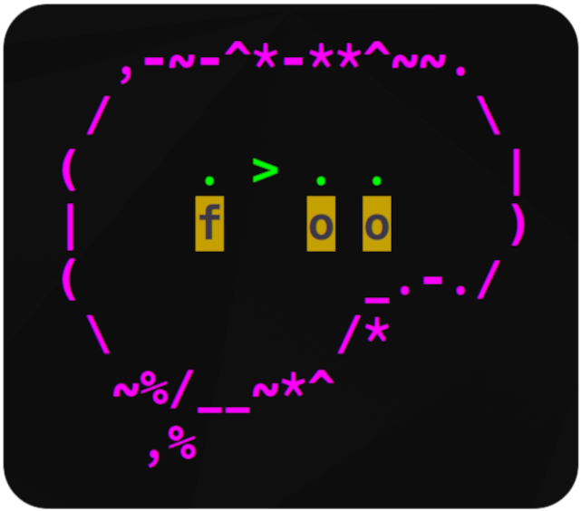

# $\Huge{\textbf{Brainfoo}}$ 


Brainfoo is a TUI debugger for Brainfk written in Python, designed to be keyboard and mouse friendly.

<br><br><br><br><br>

## Installation
Assuming you already have [uv](https://github.com/astral-sh/uv) installed:
```bash
# Clone the repository
git clone https://github.com/Sim3-14159/Brainfoo.git
cd Brainfoo

# Install dependencies
uv sync
```
To run:
```bash
uv run main.py
```

<mark>You can also download a compiled binary from the [releases page](https://github.com/Sim3-14159/Brainfoo/releases)</mark>

## Contributing
Contributing is very welcome! Brainfoo isn't a very serious project, and it is rather small, but if you have anything that you want to add to it, or you have any issues with it, feel free to [open a pull request](https://github.com/Sim3-14159/Brainfoo/compare) or [raise a new issue](https://github.com/Sim3-14159/Brainfoo/issues/new/choose).

